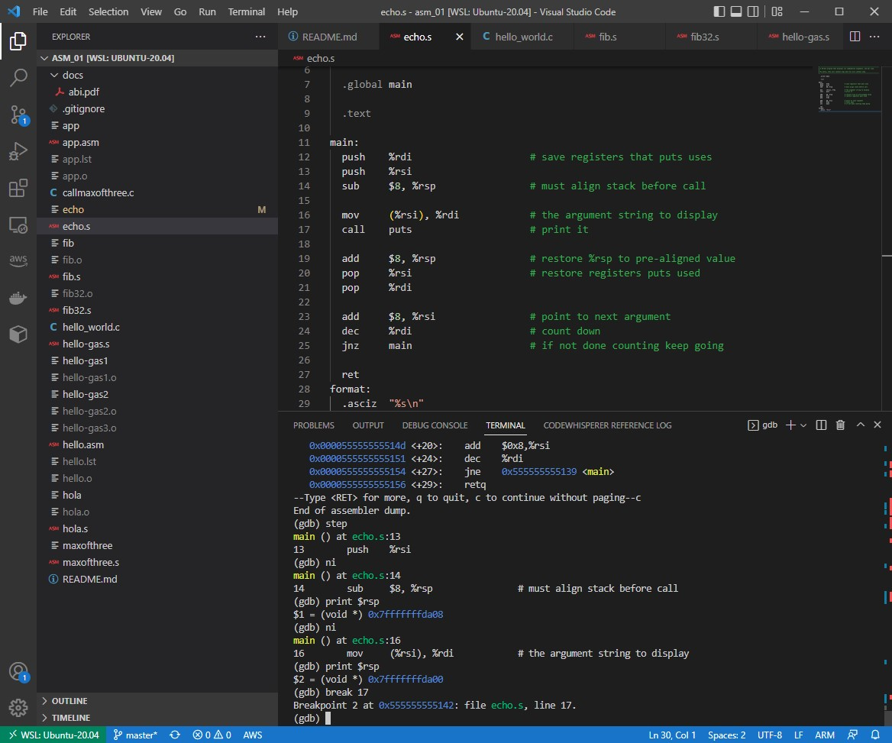

# asm_01

Learn assembly language

* [Assembly Language in 100 seconds](https://youtu.be/4gwYkEK0gOk)
* [Netwide Assembler (NASM)](https://www.nasm.us/)
* [nasm github](https://github.com/netwide-assembler/nasm)
* [Web Assembly](https://webassembly.org/)
* [yasm](https://yasm.tortall.net/)
* [yasm github](https://github.com/yasm)
* [nasm vs gas](https://developer.ibm.com/articles/l-gas-nasm/)

## 1. `nasm` Code structure

```asm
section .bss
  ; variables

section .data
  ; constants

section .text
  global _start       ; entry point for Linker

  _start:             ; start here
```

## 2. Commands

```sh
# Install nasm in Ubuntu
$ sudo apt-get install -y nasm

$ nasm -f elf64 app.asm
$ ld app.o -o app
$ ./app
Hello World!
$ ll
-rwxr-xr-x 1 ryan ryan 8920 Sep 16 16:39 app*
-rw-r--r-- 1 ryan ryan  533 Sep 16 16:34 app.asm
-rw-r--r-- 1 ryan ryan  880 Sep 16 16:39 app.o
$ objdump -d -M intel -S app

app:     file format elf64-x86-64


Disassembly of section .text:

0000000000401000 <_start>:
  401000:       b8 01 00 00 00          mov    eax,0x1
  401005:       bf 01 00 00 00          mov    edi,0x1
  40100a:       48 be 00 20 40 00 00    movabs rsi,0x402000
  401011:       00 00 00 
  401014:       ba 0d 00 00 00          mov    edx,0xd
  401019:       0f 05                   syscall 
  40101b:       b8 3c 00 00 00          mov    eax,0x3c
  401020:       bf 00 00 00 00          mov    edi,0x0
  401025:       0f 05                   syscall

  
# With interrupt 0x80 instead of system call
$ nasm -f elf -l hello.lst hello.asm
$ gcc -o hello hello.o
/usr/bin/ld: i386 architecture of input file 'hello.o' is incompatible with i386:x86-64 output
collect2: error: ld returned 1 exit status
$ ld -o hello hello.o
ld: i386 architecture of input file 'hello.o' is incompatible with i386:x86-64 output
ld: warning: cannot find entry symbol _start; defaulting to 0000000000401000
```

## 3. Assembling:
GAS:
```sh
$ as –o program.o program.s
```

NASM:
```sh
$ nasm –f elf –o program.o program.asm
```

Linking (common to both kinds of assembler):
```sh
ld –o program program.o
```

Linking when an external C library is to be used:
```sh
ld --dynamic-linker /lib/ld-linux.so.2 -lc -o program program.o
```

## 4. `gas` - GNU Assembler
GAS, the GNU Assembler, is the default assembler for the GNU Operating System. It works on many different architectures and supports several assembly language syntaxes.

* [GAS Syntax](https://en.wikibooks.org/wiki/X86_Assembly/GNU_assembly_syntax)
* [gas examples](https://cs.lmu.edu/~ray/notes/gasexamples/)
* [GNU GAS documentation](https://sourceware.org/binutils/docs/as/)

Assembling with `gcc`:
```sh
$ gcc -c hello-gas.s -o hello-gas1.o
$ ld hello-gas1.o -o hello-gas1
$ ./hello-gas1 
Hello, world
$ ll
-rwxr-xr-x 1 ryan ryan 8920 Sep 16 16:39 app*
-rw-r--r-- 1 ryan ryan  543 Sep 16 16:49 app.asm
-rw-r--r-- 1 ryan ryan 1309 Sep 16 16:47 app.lst
-rw-r--r-- 1 ryan ryan  880 Sep 16 16:47 app.o
-rw-r--r-- 1 ryan ryan  998 Sep 18 23:49 hello-gas.s
-rwxr-xr-x 1 ryan ryan 4744 Sep 18 23:50 hello-gas1*
-rw-r--r-- 1 ryan ryan  872 Sep 18 23:49 hello-gas1.o
-rw-r--r-- 1 ryan ryan  955 Sep 16 16:34 hello.asm
-rw-r--r-- 1 ryan ryan 1968 Sep 16 16:38 hello.lst
-rw-r--r-- 1 ryan ryan  640 Sep 16 16:38 hello.o
```

Assembling with linux `as`:
```sh
$ which as
/usr/bin/as
$ ll /usr/bin/as
lrwxrwxrwx 1 root root 19 Oct 20  2021 /usr/bin/as -> x86_64-linux-gnu-as*

$ as -o hello-gas2.o hello-gas.s
$ ld hello-gas2.o -o hello-gas2
$ ./hello-gas2
Hello, world
```

Size comparison:
```sh
$ ll
-rwxr-xr-x 1 ryan ryan 8920 Sep 16 16:39 app*
-rw-r--r-- 1 ryan ryan  543 Sep 16 16:49 app.asm
-rw-r--r-- 1 ryan ryan 1309 Sep 16 16:47 app.lst
-rw-r--r-- 1 ryan ryan  880 Sep 16 16:47 app.o
-rw-r--r-- 1 ryan ryan  998 Sep 18 23:49 hello-gas.s
-rwxr-xr-x 1 ryan ryan 4744 Sep 18 23:50 hello-gas1*
-rw-r--r-- 1 ryan ryan  872 Sep 18 23:49 hello-gas1.o
-rwxr-xr-x 1 ryan ryan 4744 Sep 18 23:55 hello-gas2*
-rw-r--r-- 1 ryan ryan  872 Sep 18 23:55 hello-gas2.o
-rw-r--r-- 1 ryan ryan  955 Sep 16 16:34 hello.asm
-rw-r--r-- 1 ryan ryan 1968 Sep 16 16:38 hello.lst
-rw-r--r-- 1 ryan ryan  640 Sep 16 16:38 hello.o
```

### Working with the C Library
Find the path of the dynamic linker:
```sh
$ gcc -v hello_world.c |& grep 'collect2' | tr ' ' '\n'
```
You might also need `-lgcc` and `-lgcc_s`.

Assembling with `as` and link with `ld`:
```sh
$ as -o hola.o hola.s
$ ld -dynamic-linker \
/lib64/ld-linux-x86-64.so.2 \
/usr/lib/x86_64-linux-gnu/crt1.o \
/usr/lib/x86_64-linux-gnu/crti.o \
-lc hola.o \
/usr/lib/x86_64-linux-gnu/crtn.o \
-o hola

$ ./hola
Hola, mundo
```

<details>
   <summary>Show Fibonacci</summary>

```sh
# Fibonacci
$ as -o fib.o fib.s 
$ ld -dynamic-linker \
/lib64/ld-linux-x86-64.so.2 \
/usr/lib/x86_64-linux-gnu/crt1.o \
/usr/lib/x86_64-linux-gnu/crti.o \
/usr/lib/x86_64-linux-gnu/crtn.o \
-lc -o fib fib.o

$ ./fib
                   0
                   1
                   1
                   2
                   3
                   5
                   8
                  13
                  21
                  34
                  55
                  89
                 144
                 233
                 377
                 610
                 987
                1597
                2584
                4181
                6765
               10946
               17711
               28657
               46368
               75025
              121393
              196418
              317811
              514229
              832040
             1346269
             2178309
             3524578
             5702887
             9227465
            14930352
            24157817
            39088169
            63245986
           102334155
           165580141
           267914296
           433494437
           701408733
          1134903170
          1836311903
          2971215073
          4807526976
          7778742049
         12586269025
         20365011074
         32951280099
         53316291173
         86267571272
        139583862445
        225851433717
        365435296162
        591286729879
        956722026041
       1548008755920
       2504730781961
       4052739537881
       6557470319842
      10610209857723
      17167680177565
      27777890035288
      44945570212853
      72723460248141
     117669030460994
     190392490709135
     308061521170129
     498454011879264
     806515533049393
    1304969544928657
    2111485077978050
    3416454622906707
    5527939700884757
    8944394323791464
   14472334024676221
   23416728348467685
   37889062373143906
   61305790721611591
   99194853094755497
  160500643816367088
  259695496911122585
  420196140727489673
  679891637638612258
 1100087778366101931
 1779979416004714189


# install 32bit support files
$ sudo apt install gcc-multilib
$ gcc -v -m32 -fno-asynchronous-unwind-tables -o hello_world hello_world.c  |& grep 'collect2' | tr ' ' '\n'

# Fibonacci 32-bit version
$ as --32 -o fib32.o fib32.s
$ ld -dynamic-linker \
/lib32/ld-linux.so.2 \
/usr/lib32/crt1.o \
/usr/lib32/crti.o \
/usr/lib32/crtn.o \
-lc -o fib32 fib32.o

$ gcc -m32 --enable-checking -g -O0 -o fib32 fib32.o
$ gcc -m32 --enable-checking -g -O0 -v -da -Q -o fib32 fib32.o
$ ./fib32
Segmentation fault
$ gdb fib32
(gdb) run
Starting program: /home/ryan/workspace_asm/asm_01/fib32 

Program received signal SIGSEGV, Segmentation fault.
0xf7e4dcfb in strchrnul () from /lib32/libc.so.6
(gdb) where
#0  0xf7e4dcfb in strchrnul () from /lib32/libc.so.6
#1  0xf7e2596a in ?? () from /lib32/libc.so.6
#2  0xf7e14d59 in printf () from /lib32/libc.so.6
#3  0x565561c8 in print () at fib32.s:33
(gdb) list
1       # -----------------------------------------------------------------------------
2       # A 32-bit Linux application that writes the first 90 Fibonacci numbers.  It
3       # needs to be linked with a C library.
4       #
5       # Assemble and Link:
6       #     gcc fib.s
7       # -----------------------------------------------------------------------------
8
9         .global main
10
```
</details>

### Mixing C and Assembly Language
This 64-bit program is a very simple function that takes in three 64-bit integer parameters and returns the maximum value. It shows how to extract integer parameters: They will have been pushed on the stack so that on entry to the function, they will be in `rdi`, `rsi`, and `rdx`, respectively. The return value is an integer so it gets returned in `rax`.

```sh
$ gcc -std=c99 callmaxofthree.c maxofthree.s -o maxofthree
$ ./maxofthree 
1
2
3
4
5
6
```

### Recursion
```sh
$ gcc -o callfactorial callfactorial.c factorial.s 
$ ./callfactorial 
factorial( 0) = 1
factorial( 1) = 1
factorial( 2) = 2
factorial( 3) = 6
factorial( 4) = 24
factorial( 5) = 120
factorial( 6) = 720
factorial( 7) = 5040
factorial( 8) = 40320
factorial( 9) = 362880
factorial(10) = 3628800
factorial(11) = 39916800
factorial(12) = 479001600
factorial(13) = 6227020800
factorial(14) = 87178291200
factorial(15) = 1307674368000
factorial(16) = 20922789888000
factorial(17) = 355687428096000
factorial(18) = 6402373705728000
factorial(19) = 121645100408832000
```

### Command Line Arguments

You know that in C, main is just a plain old function, and it has a couple parameters of its own:

    int main(int argc, char** argv)

Here is a program that uses this fact to simply echo the commandline arguments to a program, one per line:

```sh
$ gcc -o echo echo.s 

$ ./echo 23568 dog huh $$
./echo
23568
dog
huh
10088

$ ./echo 23568 dog huh '$$'
./echo
23568
dog
huh
$$
```

#### Debugging with `gdb`

* [Debugging IA32 Assembly Code
with gdb (and ddd)](https://www.cs.swarthmore.edu/~newhall/cs31/resources/ia32_gdb.php)



<details>
   <summary>gdb</summary>

```sh
# -g to add debugger symbols
$ gcc -g -o echo echo.s
$ gdb
# load file ./echo
(gdb) file echo
Reading symbols from echo...

# put a breakpoint at 'main'
(gdb) break main
Breakpoint 1 at 0x1139: file echo.s, line 12.
(gdb) run 123 'QQ' 45
Starting program: /home/ryan/workspace_asm/asm_01/echo 123 'QQ' 45

Breakpoint 1, main () at echo.s:12
12        push    %rdi                    # save registers that puts uses
(gdb) disass main
Dump of assembler code for function main:
=> 0x0000555555555139 <+0>:     push   %rdi
   0x000055555555513a <+1>:     push   %rsi
   0x000055555555513b <+2>:     sub    $0x8,%rsp
   0x000055555555513f <+6>:     mov    (%rsi),%rdi
   0x0000555555555142 <+9>:     callq  0x555555555030 <puts@plt>
   0x0000555555555147 <+14>:    add    $0x8,%rsp
   0x000055555555514b <+18>:    pop    %rsi
   0x000055555555514c <+19>:    pop    %rdi
   0x000055555555514d <+20>:    add    $0x8,%rsi
   0x0000555555555151 <+24>:    dec    %rdi
   0x0000555555555154 <+27>:    jne    0x555555555139 <main>
   0x0000555555555156 <+29>:    retq   
--Type <RET> for more, q to quit, c to continue without paging--c
End of assembler dump.
(gdb) step
main () at echo.s:13
13        push    %rsi

# ni = next instruction
(gdb) ni
main () at echo.s:14
14        sub     $8, %rsp                # must align stack before call
(gdb) print $rsp
$1 = (void *) 0x7fffffffda08
(gdb) break 17
Breakpoint 2 at 0x555555555142: file echo.s, line 17.
(gdb) cont
Continuing.

Breakpoint 2, main () at echo.s:17
17        call    puts                    # print it
(gdb) ni
/home/ryan/workspace_asm/asm_01/echo
19        add     $8, %rsp                # restore %rsp to pre-aligned value
(gdb) break 23
Breakpoint 3 at 0x55555555514d: file echo.s, line 23.
(gdb) next
main () at echo.s:20
20        pop     %rsi                    # restore registers puts used
(gdb) ni
main () at echo.s:21
21        pop     %rdi

# step into a function call (step instruction)
(gdb) si

Breakpoint 3, main () at echo.s:23
23        add     $8, %rsi                # point to next argument
(gdb) display $rsi
1: $rsi = 140737488345864
(gdb) break *0x555555555154
Breakpoint 4 at 0x555555555154: file echo.s, line 25.
(gdb) si
24        dec     %rdi                    # count down
1: $rsi = 140737488345872
(gdb) ni

Breakpoint 4, main () at echo.s:25
25        jnz     main                    # if not done counting keep going
1: $rsi = 140737488345872
(gdb) si

Breakpoint 1, main () at echo.s:12
12        push    %rdi                    # save registers that puts uses
1: $rsi = 140737488345872
(gdb) ni
main () at echo.s:13
13        push    %rsi
1: $rsi = 140737488345872
(gdb) si
main () at echo.s:14
14        sub     $8, %rsp                # must align stack before call
1: $rsi = 140737488345872

# show register values
(gdb) info registers
rax            0x25                37
rbx            0x555555555160      93824992235872
rcx            0x7ffff7ecd077      140737352880247
rdx            0x0                 0
rsi            0x5555555592a0      93824992252576
rdi            0x7ffff7fad7e0      140737353799648
rbp            0x0                 0x0
rsp            0x7fffffffda00      0x7fffffffda00
r8             0x25                37
r9             0x7c                124
r10            0x7ffff7fabbe0      140737353792480
r11            0x246               582
r12            0x555555555050      93824992235600
r13            0x7fffffffdb00      140737488345856
r14            0x0                 0
r15            0x0                 0
rip            0x555555555147      0x555555555147 <main+14>
eflags         0x246               [ PF ZF IF ]
cs             0x33                51
ss             0x2b                43
ds             0x0                 0
--Type <RET> for more, q to quit, c to continue without paging--c

(gdb) disass
Dump of assembler code for function main:
   0x0000555555555139 <+0>:     push   %rdi
   0x000055555555513a <+1>:     push   %rsi
   0x000055555555513b <+2>:     sub    $0x8,%rsp
   0x000055555555513f <+6>:     mov    (%rsi),%rdi
   0x0000555555555142 <+9>:     callq  0x555555555030 <puts@plt>
=> 0x0000555555555147 <+14>:    add    $0x8,%rsp
   0x000055555555514b <+18>:    pop    %rsi
   0x000055555555514c <+19>:    pop    %rdi
   0x000055555555514d <+20>:    add    $0x8,%rsi
   0x0000555555555151 <+24>:    dec    %rdi
   0x0000555555555154 <+27>:    jne    0x555555555139 <main>
   0x0000555555555156 <+29>:    retq   
End of assembler dump.
(gdb) break *0x000055555555514d
Breakpoint 3 at 0x55555555514d: file echo.s, line 23.
(gdb) cont
Continuing.

Breakpoint 3, main () at echo.s:23
23        add     $8, %rsi                # point to next argument
(gdb) p $rsi
$2 = 140737488345864
(gdb) display $rsi
1: $rsi = 140737488345864

(gdb) ni
24        dec     %rdi                    # count down
1: $rsi = 140737488345872
(gdb) p $rdi
$3 = 4
(gdb) ni
25        jnz     main                    # if not done counting keep going
1: $rsi = 140737488345872
(gdb) ni

Breakpoint 1, main () at echo.s:12
12        push    %rdi                    # save registers that puts uses
1: $rsi = 140737488345872
(gdb) cont
Continuing.

Breakpoint 2, main () at echo.s:17
17        call    puts                    # print it
1: $rsi = 140737488345872
(gdb) disass
Dump of assembler code for function main:
   0x0000555555555139 <+0>:     push   %rdi
   0x000055555555513a <+1>:     push   %rsi
   0x000055555555513b <+2>:     sub    $0x8,%rsp
   0x000055555555513f <+6>:     mov    (%rsi),%rdi
=> 0x0000555555555142 <+9>:     callq  0x555555555030 <puts@plt>
   0x0000555555555147 <+14>:    add    $0x8,%rsp
   0x000055555555514b <+18>:    pop    %rsi
   0x000055555555514c <+19>:    pop    %rdi
   0x000055555555514d <+20>:    add    $0x8,%rsi
   0x0000555555555151 <+24>:    dec    %rdi
   0x0000555555555154 <+27>:    jne    0x555555555139 <main>
   0x0000555555555156 <+29>:    retq   
End of assembler dump.
(gdb) p *(int *)($rsi)
$4 = -8736
(gdb) p ($rsi)
$5 = 140737488345872
(gdb) display ($rsi)
2: ($rsi) = 140737488345872
(gdb) p (char *)($rsi)
$6 = 0x7fffffffdb10 "\340\335\377\377\377\177"
(gdb) cont
Continuing.
123

Breakpoint 3, main () at echo.s:23
23        add     $8, %rsi                # point to next argument
1: $rsi = 140737488345872
2: ($rsi) = 140737488345872
(gdb) display $rdi
3: $rdi = 3
(gdb) cont
Continuing.

Breakpoint 1, main () at echo.s:12
12        push    %rdi                    # save registers that puts uses
1: $rsi = 140737488345880
2: ($rsi) = 140737488345880
3: $rdi = 2
(gdb) p (char *)($rsi)
$7 = 0x7fffffffdb18 "\344\335\377\377\377\177"
(gdb) cont
Continuing.

Breakpoint 2, main () at echo.s:17
17        call    puts                    # print it
1: $rsi = 140737488345880
2: ($rsi) = 140737488345880
3: $rdi = 140737488346596
(gdb) p (char *)($rsi)
$8 = 0x7fffffffdb18 "\344\335\377\377\377\177"
(gdb) cont
Continuing.
QQ

Breakpoint 3, main () at echo.s:23
23        add     $8, %rsi                # point to next argument
1: $rsi = 140737488345880
2: ($rsi) = 140737488345880
3: $rdi = 2
(gdb) cont
Continuing.

Breakpoint 1, main () at echo.s:12
12        push    %rdi                    # save registers that puts uses
1: $rsi = 140737488345888
2: ($rsi) = 140737488345888
3: $rdi = 1
(gdb) ni
main () at echo.s:13
13        push    %rsi
1: $rsi = 140737488345888
2: ($rsi) = 140737488345888
3: $rdi = 1
(gdb) ni
main () at echo.s:14
14        sub     $8, %rsp                # must align stack before call
1: $rsi = 140737488345888
2: ($rsi) = 140737488345888
3: $rdi = 1
(gdb) ni
main () at echo.s:16
16        mov     (%rsi), %rdi            # the argument string to display
1: $rsi = 140737488345888
2: ($rsi) = 140737488345888
3: $rdi = 1
(gdb) p (char *)($rsp)
$9 = 0x7fffffffda00 ""
(gdb) cont
Continuing.

Breakpoint 2, main () at echo.s:17
17        call    puts                    # print it
1: $rsi = 140737488345888
2: ($rsi) = 140737488345888
3: $rdi = 140737488346599
(gdb) cont
Continuing.
45

Breakpoint 3, main () at echo.s:23
23        add     $8, %rsi                # point to next argument
1: $rsi = 140737488345888
2: ($rsi) = 140737488345888
3: $rdi = 1
(gdb) cont
Continuing.
[Inferior 1 (process 20714) exited with code 03]

# to force quit
(gdb) quit
A debugging session is active.

        Inferior 1 [process 18573] will be killed.

Quit anyway? (y or n) y
```
</details>

#### `gdb` summary
```sh
(gdb) break main
  (gdb) run  6              # run with the command line argument 6
  (gdb) disass main         # disassemble the main function
  (gdb) break sum           # set a break point at the beginning of a function
  (gdb) cont                # continue execution of the program
  (gdb) break *0x0804851a   # set a break point at memory address 0x0804851a
  (gdb) ni                  # execute the next instruction
  (gdb) si                  # step into a function call (step instruction)
  (gdb) info registers      # list the register contents
  (gdb) p $eax              # print the value stored in register %eax
  (gdb) p  *(int *)($ebp+8) # print out value of an int at addr (%ebp+8)
  (gdb) x/wd $ebp+8         # examine the contents of memory at the given address
                            # as an int (w: word-size value d: in decimal) 
                            # display type in x is sticky: subsequent x commands
                            # will display values in decimal until another type is
                            # specified (ex. x/a $ebp+8  # as an address in hex)
  (gdb) x/s 0x0800004       # examine contents of memory at address as a string
  (gdb) x/wd 0xff5634       # after x/s, the unit size is 1 byte, so if want
                            # to examine as an int specify both the width w and d

# breakpoint with a condition
(gdb) break file1.c:6 if i >= ARRAYSIZE

# See the value (memory address) of the pointer:
(gdb) print e1

# See a particular field of the struct the pointer is referencing:
(gdb) print e1->key
(gdb) print e1->name
(gdb) print e1->price
(gdb) print e1->serial number

# Using pointers with gdb II
#You can also use the dereference (*) and dot (.) operators in place of the arrow operator (->):
(gdb) print (*e1).key
(gdb) print (*e1).name
(gdb) print (*e1).price
(gdb) print (*e1).serial number

# See the entire contents of the struct the pointer references (you can’t do this as easily in C!):
(gdb) print *e1

# You can also follow pointers iteratively, like in a linked list:
(gdb) print list prt->next->next->next->data

```

## Calling Conventions for 64-bit C Code

* [X86 Disassembly/Calling Conventions](https://en.wikibooks.org/wiki/X86_Disassembly/Calling_Conventions)
* [AMD64 ABI Reference](docs/abi.pdf)
* [System V ABI - gitlab](https://gitlab.com/x86-psABIs/x86-64-ABI)

The most important points are (again, for 64-bit Linux, not Windows):

* From left to right, pass as many parameters as will fit in registers. The order in which registers are allocated, are:
  * For **integers** and **pointers**, `rdi`, `rsi`, `rdx`, `rcx`, `r8`, `r9`.
  * For **floating-point** (float, double), `xmm0`, `xmm1`, `xmm2`, `xmm3`, `xmm4`, `xmm5`, `xmm6`, `xmm7`
* Additional parameters are pushed on the stack, right to left, and are removed by the caller after the call.
* After the parameters are pushed, the call instruction is made, so when the called function gets control, the return address is at (%rsp), the first memory parameter is at 8(%rsp), etc.
* **THE STACK POINTER %RSP MUST BE ALIGNED TO A 16-BYTE BOUNDARY BEFORE MAKING A CALL**. Fine, but the process of making a call pushes the return address (8 bytes) on the stack, so when a function gets control, `%rsp` is not aligned. You have to make that extra space yourself, by pushing something or subtracting 8 from `%rsp`.
* The only registers that the called function is required to preserve (the calle-save registers) are: `rbp`, `rbx`, `r12`, `r13`, `r14`, `r15`. All others are free to be changed by the called function.
* The callee is also supposed to save the control bits of the **XMCSR** and the _x87 control word_, but x87 instructions are rare in 64-bit code so you probably don't have to worry about this.
* Integers are returned in `rax` or `rdx:rax`, and floating point values are returned in `xmm0` or `xmm1:xmm0`.

## Operation Suffixes
GAS assembly instructions are generally suffixed with the letters "b", "s", "w", "l", "q" or "t" to determine what size operand is being manipulated.

* `b` = byte (8 bit).
* `s` = single (32-bit floating point).
* `w` = word (16 bit).
* `l` = long (32 bit integer or 64-bit floating point).
* `q` = quad (64 bit).
* `t` = ten bytes (80-bit floating point).

If the suffix is not specified, and there are no memory operands for the instruction, GAS infers the operand size from the size of the destination register operand (the final operand).

Of course, all general-purpose registers are 64 bits wide. The old ones we already knew are easy to recognize in their 64-bit form: `rax`, `rbx`, `rcx`, `rdx`, `rsi`, `rdi`, `rbp`, `rsp` (and `rip` if we want to count the instruction pointer). These old registers can still be accessed in their smaller bit ranges, for instance: `rax`, `eax`, `ax`, `ah`, `al`. The new registers go from r8 to r15, and can be accessed in their various bit ranges like this: `r8` (qword), `r8d` (dword), `r8w` (word), `r8b` (low byte).

## assembler syntaxes:

1. nasm
    NASM syntax is the most full-featured syntax supported by Yasm. Yasm is nearly 100% compatible with NASM for 16-bit and 32-bit x86 code. Yasm additionally supports 64-bit AMD64 code with Yasm extensions to the NASM syntax. For more details see Part II.

2. gas
    The GNU Assembler (GAS) is the de-facto cross-platform assembler for modern Unix systems, and is used as the backend for the GCC compiler. Yasm’s support for GAS syntax is moderately good, although immature: not all directives are supported, and only 32-bit x86 and AMD64 architectures are supported. There is also no support for the GAS preprocessor. Despite these limitations, Yasm’s GAS syntax support is good enough to handle essentially all x86 and AMD64 GCC compiler output. For more details see Part III.
